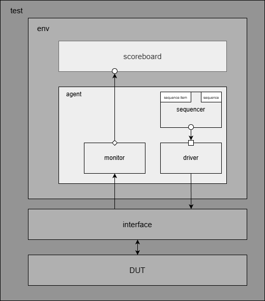
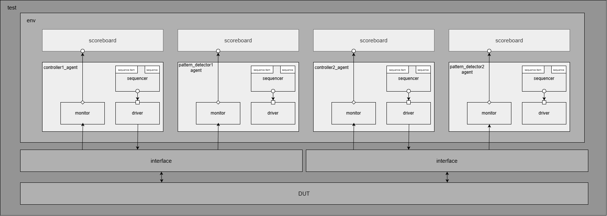

# I²C Protocol Implementation and Verification

A complete RTL implementation of the I²C (Inter-Integrated Circuit) communication protocol with comprehensive UVM-based verification infrastructure. This repository demonstrates industry-standard verification methodologies and modular RTL design principles.

## 📋 Table of Contents

- [Protocol Overview](#protocol-overview)
- [Design Architecture](#design-architecture)
- [RTL Implementation Details](#rtl-implementation-details)
- [UVM Verification Environment](#uvm-verification-environment)
- [Directory Structure](#directory-structure)
- [Synthesis and Implementation](#synthesis-and-implementation)
- [Getting Started](#getting-started)
- [References](#references)

## 🔍 Protocol Overview

### I²C Communication Fundamentals

I²C is a multi-controller, multi-target serial communication protocol using two bidirectional lines:

- **SDA (Serial Data)**: Bidirectional data line for transmitting addresses and data
- **SCL (Serial Clock)**: Bidirectional clock line for synchronization

Both lines utilize **pull-up resistors**, establishing a default logic high state. Devices can only pull lines low, creating a wired-AND configuration that enables multi-controller operation.

### Core Protocol Mechanics

#### Data Validity Rule
The fundamental timing requirement: SDA must remain stable whenever SCL is high. SDA transitions are only permitted when SCL is low. Violations of this rule define START and STOP conditions.

#### START Condition
Initiated by the controller when SDA transitions from high to low while SCL remains high. This signals the beginning of a transaction and alerts all targets on the bus.

#### STOP Condition
Generated when SDA transitions from low to high while SCL is high. This indicates transaction completion and returns the bus to idle state.

#### Transaction Frame Structure

A complete I²C transaction consists of:
1. START condition generation
2. 7-bit target address transmission plus R/W bit
3. ACK/NACK from target
4. Data byte(s) transmission (8 bits each)
5. ACK/NACK after each byte
6. STOP condition generation

#### Acknowledgment Protocol

**ACK (Acknowledge)** - Target pulls SDA low during the 9th clock cycle:
- Confirms successful data reception
- Indicates readiness for additional data
- Validates address match

**NACK (Not Acknowledge)** - SDA remains high during 9th clock cycle:
- Target address not present on bus
- Target unable to receive (busy with real-time operations)
- Target doesn't recognize command or data
- Target buffer full, cannot accept more data
- Controller-receiver signaling end of transfer

#### Restart Condition
A START condition generated without a preceding STOP, allowing the controller to maintain bus ownership while initiating a new transaction. Essential for combined read/write operations.

## 🏗️ Design Architecture

### System Block Diagram


### Module Responsibilities

**I2C_Interface**
- Top-level wrapper providing clean external interface
- Signal routing between internal modules and I/O ports
- Pull-up resistor simulation for SDA and SCL
- Tri-state buffer management

**I2C_Controller**
- Master state machine controlling transaction flow
- START and STOP condition generation
- Byte-level transmission sequencing
- ACK/NACK detection and response
- Error detection and reporting

**I2C_Pattern_Detector**
- START condition detection (SDA falling edge when SCL high)
- STOP condition detection (SDA rising edge when SCL high)
- Address matching against configured target address
- R/W bit extraction and validation

**I2C_Transmitter**
- Parallel-to-serial data conversion
- SDA line driving with proper timing
- Tri-state control during ACK cycles
- MSB-first bit ordering
- SCL synchronization

**I2C_Receiver**
- Serial-to-parallel data conversion
- SDA sampling at appropriate clock edges
- ACK/NACK generation
- Data buffering

## 📦 RTL Implementation Details

### I2C_Controller Design

The controller implements a comprehensive state machine managing all transaction phases:

**State Machine Architecture:**
- **IDLE**: Waiting for transaction request, monitoring bus
- **START**: Generating START condition, preparing address phase
- **ADDR_PHASE**: Transmitting 7-bit address and R/W bit
- **ACK_CHECK**: Monitoring target acknowledgment
- **DATA_PHASE**: Transmitting or receiving data bytes
- **ACK_WAIT**: Handling acknowledgment after data
- **RESTART**: Generating restart condition for consecutive transactions
- **STOP**: Generating STOP condition, returning to IDLE
- **ERROR**: Handling protocol violations, timeouts, NACK responses

### I2C_Pattern_Detector Design

**Edge Detection Logic:**
Implements dual-edge detection on SDA while monitoring SCL state. Captures previous SDA state to identify transitions qualifying as START or STOP conditions.

**Address Matching:**
- Captures 7 address bits following START detection
- Compares with parameterized target address
- Generates match signal driving subsequent operations
- Separates R/W bit for operation determination

### I2C_Transmitter Design

**Shift Register Implementation:**
Loads parallel data and shifts out serially, MSB first. Bit counter tracks transmission progress through 8-bit sequence.

**Timing Coordination:**
Ensures data settles on SDA before SCL rises, maintaining setup time. Holds data stable throughout SCL high period. Changes data only when SCL is low.

### I2C_Receiver Design

**Sampling Strategy:**
Captures SDA value on SCL rising edge or at mid-point of high period. Input synchronization through multi-stage flip-flops prevents metastability.

**Shift Register:**
Accumulates 8 bits into parallel format. Bit counter determines when complete byte received.

**ACK Generation Logic:**
After receiving 8 bits, pulls SDA low during 9th clock to acknowledge, or leaves high for NACK.

## 🧪 UVM Verification Environment

### Verification Architecture Overview

The verification strategy employs a three-tier approach:

1. **Block-Level Verification**: Individual module testing with focused stimulus
2. **Integration Verification**: Multi-module interaction validation
3. **System-Level Verification**: Complete protocol compliance checking

### UVM Testbench Hierarchy

#### Block Level Environment


#### System Level Environment


### UVM Component Descriptions

#### Sequence Item (Transaction)

**I2C_Controller_sequence_item:**
Defines transaction-level stimulus containing:
- Data payload
- Target address
- Operation type (read/write)
- Transaction valid indicator
- Restart flag
- Error injection fields

**I2C_Pattern_Detector_sequence_item:**
Captures protocol-level events:
- SDA and SCL states
- START/STOP detection flags
- Address match indicators
- ACK/NACK values

#### Sequences

**Randomized Sequences:**
Apply constrained-random stimulus across valid parameter space. Constraints ensure legal I²C protocol adherence while exploring corner cases.

**Directed Sequences:**
Target specific scenarios:
- **Restart Sequence**: Validates restart condition generation without STOP
- **Read Transaction**: Complete read operation from addressed target
- **Write Transaction**: Full write operation with data transfer
- **STOP Sequences**: Various STOP condition scenarios
- **Address Sequences**: Address matching and mismatching cases
- **Wrong Address**: Tests behavior when address doesn't match

#### Sequencer

**I2C_Controller_sequencer:**
Manages sequence execution, arbitrates between concurrent sequences, controls sequence flow.

**I2C_Pattern_Detector_sequencer:**
Coordinates pattern-specific test sequences.

#### Virtual Sequences

**I2C_Controller_virtual_sequence:**
Orchestrates multiple sequences running on the controller sequencer, enabling complex multi-phase transaction testing.

**I2C_Pattern_Detector_virtual_sequence:**
Combines pattern detection sequences for comprehensive protocol verification.

**I2C_virtual_sequence (System-Level):**
Coordinates sequences across multiple agents, synchronizing controller and target behaviors for end-to-end validation.

#### Driver

**I2C_Controller_driver:**
Receives sequence items from sequencer, converts to pin-level stimulus on DUT interface. Implements precise timing for START/STOP generation, manages SDA/SCL toggling according to protocol.

**I2C_Pattern_Detector_driver:**
Applies low-level SDA/SCL patterns for pattern detection testing.

#### Monitor

**I2C_Controller_monitor:**
Observes DUT controller interface, reconstructs high-level transactions from pin activity. Broadcasts transactions via analysis port for scoreboard consumption.

**I2C_Pattern_Detector_monitor:**
Tracks SDA/SCL transitions, detects protocol events (START, STOP, ACK/NACK), captures address and data bytes.

#### Scoreboard

**I2C_Controller_scoreboard:**
Implements reference model predicting expected DUT responses. Compares monitor-captured transactions against predictions. Reports mismatches as errors. Tracks transaction counts.

**I2C_Pattern_Detector_scoreboard:**
Validates pattern detection accuracy, confirms START/STOP timing, verifies address matching logic.

#### Agent

**I2C_Controller_agent:**
Encapsulates driver, monitor, and sequencer for the controller interface. Configurable as active (driving signals) or passive (monitoring only).

**I2C_Pattern_Detector_agent:**
Packages pattern detection components. Typically configured as passive for system-level testing.

#### Environment

**I2C_Controller_environment:**
Instantiates controller agent, scoreboard, and coverage collector. Connects components via analysis ports. Configures agent operation modes.

**I2C_Pattern_Detector_environment:**
Assembles pattern detector verification components.

**I2C_environment (System-Level):**
Integrates both controller and pattern detector agents, system scoreboard, protocol checkers, and comprehensive coverage collector.

#### Test

**I2C_Controller_test:**
Base test class establishing environment, applying configuration object, running sequences. Derived tests customize sequence selection and parameters.

**I2C_Pattern_Detector_test:**
Focused on pattern detection scenarios.

**I2C_test (System-Level):**
Comprehensive protocol testing combining controller and target operations.

#### Testbench Top

**I2C_Controller_top:**
SystemVerilog module instantiating DUT, interface, clock generation, and test invocation.

**I2C_Pattern_Detector_top:**
Top-level for pattern detector verification.

**I2C_top (System-Level):**
Complete system testbench with multiple I²C modules interconnected.

### Assertions

**I2C_Pattern_Detector_assertions:**
SystemVerilog assertions verifying:
- START condition timing (SDA falls before SCL)
- STOP condition timing (SDA rises before SCL)
- Data stability (SDA constant when SCL high)
- ACK/NACK protocol compliance
- Setup and hold time requirements

**I2C_assertion1 & I2C_assertion2:**
System-level protocol checks validating complete transaction sequences.

## 📁 Directory Structure

```
I2C-Protocol-Implementation/
│
├── I2C.do
├── I2C.list
│
├── I2C_Controller.do
├── I2C_Controller.list
│
├── I2C_Pattern_Detector.do
├── I2C_Pattern_Detector.list
│
├── I2C/
│   ├── I2C.pdf
│   ├── I2C.sv
│   ├── I2C_agent.sv
│   ├── I2C_assertion1.sv
│   ├── I2C_assertion2.sv
│   ├── I2C_configuration_object.sv
│   ├── I2C_environment.sv
│   ├── I2C_interface.sv
│   ├── I2C_Receiver.sv
│   ├── I2C_test.sv
│   ├── I2C_top.sv
│   ├── I2C_top_design.sv
│   ├── I2C_Transmitter.sv
│   ├── I2C_verificationplan.pdf
│   └── I2C_virtual_sequence.sv
│
├── I2C_Controller/
│   ├── clock_divider.sv
│   ├── controller_verificationplan.pdf
│   ├── I2C_configuration_object.sv
│   ├── I2C_Controller.log
│   ├── I2C_Controller.sv
│   ├── I2C_Controller_agent.sv
│   ├── I2C_Controller_directed_restart_sequence.sv
│   ├── I2C_Controller_directed_start_transaction_read_sequence.sv
│   ├── I2C_Controller_directed_start_transaction_write_sequence.sv
│   ├── I2C_Controller_directed_stop_SDA_sequence.sv
│   ├── I2C_Controller_directed_stop_valid_sequence.sv
│   ├── I2C_Controller_driver.sv
│   ├── I2C_Controller_environment.sv
│   ├── I2C_Controller_monitor.sv
│   ├── I2C_Controller_randomized_sequence.sv
│   ├── I2C_Controller_scoreboard.sv
│   ├── I2C_Controller_sequence_item.sv
│   ├── I2C_Controller_sequencer.sv
│   ├── I2C_Controller_test.sv
│   ├── I2C_Controller_top.sv
│   ├── I2C_Controller_virtual_sequence.sv
│   └── I2C_interface.sv
│
└── I2C_Patten_detector/
    ├── I2C_configuration_object.sv
    ├── I2C_interface.sv
    ├── I2C_Pattern_Detector.log
    ├── I2C_Pattern_Detector.sv
    ├── I2C_Pattern_Detector_agent.sv
    ├── I2C_Pattern_Detector_assertion.sv
    ├── I2C_Pattern_Detector_directed_address_sequence.sv
    ├── I2C_Pattern_Detector_directed_read_sequence.sv
    ├── I2C_Pattern_Detector_directed_reset_sequence.sv
    ├── I2C_Pattern_Detector_directed_start_sequence.sv
    ├── I2C_Pattern_Detector_directed_stop_sequence.sv
    ├── I2C_Pattern_Detector_directed_write_sequence.sv
    ├── I2C_Pattern_Detector_directed_wrong_address_sequence.sv
    ├── I2C_Pattern_Detector_driver.sv
    ├── I2C_Pattern_Detector_environment.sv
    ├── I2C_Pattern_Detector_monitor.sv
    ├── I2C_Pattern_Detector_randomized_sequence.sv
    ├── I2C_Pattern_Detector_scoreboard.sv
    ├── I2C_Pattern_Detector_sequence_item.sv
    ├── I2C_Pattern_Detector_sequencer.sv
    ├── I2C_Pattern_Detector_test.sv
    ├── I2C_Pattern_Detector_top.sv
    ├── I2C_Pattern_Detector_virtual_sequence.sv
    └── pattern_detector_verificationplan.pdf
```

### Implementation Flow

1. **RTL Elaboration**: Design analysis and hierarchy expansion
2. **Synthesis**: Logic optimization and technology mapping
3. **Place and Route**: Physical implementation on target device
4. **Static Timing Analysis**: Verification of timing requirements
5. **Bitstream Generation**: Final programming file creation

## 🚀 Getting Started

### Prerequisites

**Simulation Tools:**
- Questasim/ModelSim 10.7+ or Vivado Simulator 2020.1+
- UVM 1.2 library (IEEE 1800.2)

**Synthesis Tools:**
- Xilinx Vivado 2020.1+ or Synopsys Design Compiler

**Languages:**
- SystemVerilog (IEEE 1800-2017) for verification
- Verilog (IEEE 1364-2005) for RTL

### Running Simulations

**Block-Level Controller Simulation:**
Navigate to simulation scripts and execute controller testbench. Waveforms and coverage reports generated in designated directories.

**Block-Level Pattern Detector Simulation:**
Run pattern detector testbench for focused verification of START/STOP detection and address matching.

**System-Level Simulation:**
Execute complete system tests validating end-to-end protocol operation across multiple modules.

### Synthesis

Use provided TCL scripts to synthesize design for target FPGA. Review timing and utilization reports in synthesis/reports directory.

## 📚 References

- I²C Specification: NXP Semiconductors UM10204
